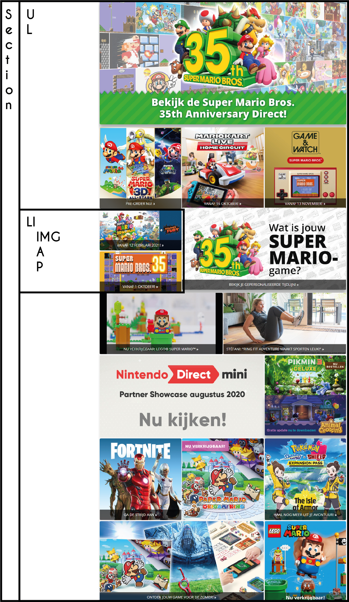

# Procesverslag
**Auteur:** Mark Schutte

Markdown cheat cheet: [Hulp bij het schrijven van Markdown](https://github.com/adam-p/markdown-here/wiki/Markdown-Cheatsheet). Nb. de standaardstructuur en de spartaanse opmaak zijn helemaal prima. Het gaat om de inhoud van je procesverslag. Besteedt de tijd voor pracht en praal aan je website.

## Bronnenlijst
1. https://www.nintendo.nl/
2. https://codepen.io/LantareCode/pen/dOXmBJ
3. https://cssgrid-generator.netlify.app/
4. https://www.sitepoint.com/css-grid-generators/ 
5. https://community.adobe.com/t5/dreamweaver/expected-rbrace-at-line-4-col-2-is-this-error-a-bug/td-p/10547718?page=1
6. http://csslint.net/
7. https://developer.mozilla.org/en-US/docs/Web/CSS/Media_Queries/Using_media_queries
8. https://www.w3schools.com/howto/tryit.asp?filename=tryhow_css_arrows
9. https://www.wikihow.com/Add-Facebook-Plugin-to-Website
10. https://developers.facebook.com/docs/plugins/page-plugin
11. https://code-boxx.com/simple-responsive-pure-css-hamburger-menu/
12. https://css-tricks.com/working-with-javascript-media-queries/
13. https://www.w3schools.com/howto/howto_js_media_queries.asp
14. Robert (uiteraard ;))

## Eindgesprek (week 7/8)

-dit ging goed & dit was lastig-

**Screenshot(s):**

-screenshot(s) van je eindresultaat-

## Voortgang 3 (week 6)
### Feedback Victor
- transform 180 graden pijltje bij land x
- menu kleiner maken onder 400 px (login, cart, search) x
- header -1em veranderen (1em auto) zodat de witruimte weg is x
- minder gebruik maken van classes meer direct aanspreken (main ul li a)
- nieuws div maken naar article maken (robert)
- delen - > section veranderen naar a klikbaar (robert)
- Hamburger menu maken x
- transision hover effect (uitgelicht, langzame animatie) x

### Nog te doen
- Search werkt nog niet (javascript + css)
- Tweede pagina maken (super smash bros) x
- tweede pagina mobiel acceptabel maken x
- Uitklapbaar menu maken (hamburger, media query scherm minder dan xxx aantal em/px) x
- Namen classnames
- Class footer veranderen
- Class head veranderen
- Stijlen tweede pagina x
- w3 validator
- css linter

## Voortgang 2 (week 5)
- Feedback Victor
transform 180 graden pijltje bij land
menu kleiner maken onder 400 px (login, cart, search)
header -1em veranderen (1em auto) zodat de witruimte weg is
minder gebruik maken van classes meer direct aanspreken (main ul li a)
nieuws div maken naar article maken (robert)
delen - > section veranderen naar a klikbaar (robert)
Hamburger menu maken
transision hover effect (uitgelicht) 

### Gedaan
- Helaas kan ik de juiste icoontjes niet vinden van Nintendo zelf, nu zelf maar icoontjes gemaakt en gebruikt op de website (in overleg) x
- Kopje "Meer nieuws" stijlen x
- Hover toevoegen + shadow (grid) x
- Hover menu x
- "meer nieuws" kopje stijlen x
- Link text titel nieuws (underline) x
- Text op grid (over afbeelding) x

### Nog te doen
- Search werkt nog niet (javascript + css)
- Tweede pagina maken (super smash bros)
- Uitklapbaar menu maken (hamburger, media query scherm minder dan xxx aantal em/px)
- Namen classnames
- Class footer veranderen
- Class head veranderen
- Stijlen tweede pagina
- w3 validator
- css linter

## Voortgang 1 (week 3)

### Stand van zaken

- De feedback die ik ontvangen had was nuttig en terecht. Er zaten een aantal foutjes in die makkelijk herstelbaar waren wat ik ook gedaan heb.
- Goed, Positieve feedback, gerichte feedback, makkelijk aan te passen. 
- Lastig, Javascript omgooien, inmiddels gefixt.

**Screenshot(s):**

-screenshot(s) van hoe ver je bent-

### Agenda voor meeting

-samen met je groepje opstellen-

### Verslag van meeting

Verbeterpunten
Verbeterpunten met een x zijn gefixed.
#### HTML
* Bovenste script javascript weghalen in head(is overbodig) x
* Namen classnames
* Class footer veranderen
* Class head veranderen
* Onclick veranderen -> gebruik gemaakt van queryselector en addEventListener ipv onlick x

#### CSS (css linter)
* font-family naar body verplaatsen x
* xxl font-size veranderen naar em x
* small font-size x
* ticon en ficon verwijderen  (classes) x
* footer 2x position x

## Intake (week 1)

**Je startniveau:** Rood

**Je focus:** Responsive

**Je opdracht:** https://www.nintendo.nl/ , https://www.nintendo.nl/Games/Nintendo-Switch/Super-Smash-Bros-Ultimate-1395713.html

**Screenshot(s):**

**Breakdown-schets(en):**

